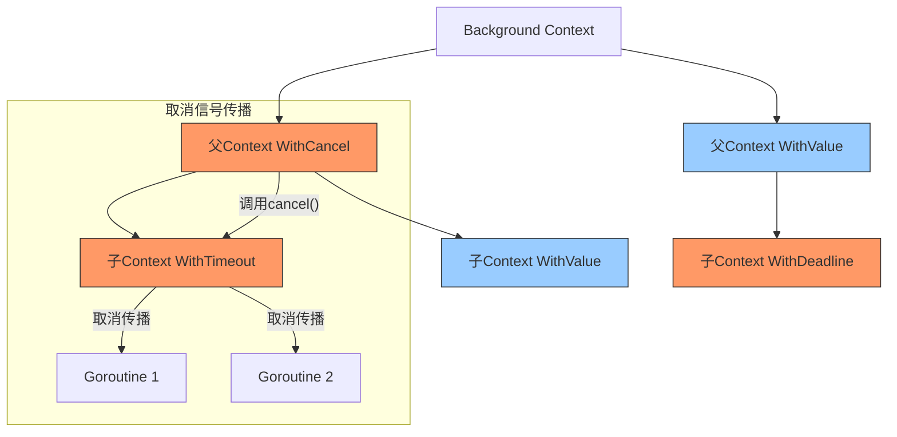
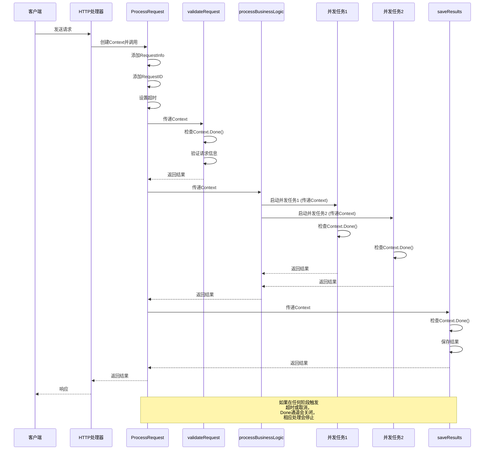

# Context 模式 (Context Pattern)

## 简介

Context模式是Go语言中的一种行为型设计模式，用于在API边界和进程之间传递请求范围的值、取消信号和截止时间。这种模式在处理并发、超时和取消等场景中尤为重要，是Go语言并发控制的核心模式之一。

## 核心概念

Context模式基于Go标准库的`context`包实现，主要围绕以下核心概念：

1. **请求范围的值传递** - 在请求链中传递请求相关的数据
2. **取消信号传播** - 允许取消信号沿着调用链向下传播
3. **超时控制** - 为操作设置截止时间，防止无限期等待
4. **并发控制** - 在多个goroutine之间协调工作



## 结构和组件

Context模式的主要组件包括：

1. **context.Context接口** - 定义了基本操作，包括：
   - `Deadline()` - 返回Context的截止时间
   - `Done()` - 返回一个通道，该通道在Context被取消时关闭
   - `Err()` - 如果Context已取消，返回取消原因
   - `Value()` - 返回与指定键关联的值

2. **派生Context** - 通过以下方式创建：
   - `context.Background()` - 创建根Context
   - `context.WithValue()` - 携带键值对的Context
   - `context.WithCancel()` - 可取消的Context
   - `context.WithTimeout()` - 有超时限制的Context
   - `context.WithDeadline()` - 有截止时间的Context

## 实现特性

我们的Context模式实现具有以下特性：

### 值传递

```go
// 自定义Context键类型
type contextKey string

// 添加值到Context
ctx = context.WithValue(ctx, requestInfoKey, requestInfo)

// 从Context获取值
info, ok := ctx.Value(requestInfoKey).(RequestInfo)
```

### 请求跟踪

```go
// 生成并添加请求ID
ctx = WithRequestID(ctx)

// 记录请求日志
requestID, _ := GetRequestID(ctx)
log.Printf("[%s] Starting request processing...", requestID)
```

### 取消和超时控制

```go
// 创建可取消的上下文
ctx, cancel := context.WithTimeout(ctx, timeout)
defer cancel() // 确保资源被释放

// 检查取消信号
select {
case <-ctx.Done():
    return mapContextError(ctx.Err())
case <-time.After(500 * time.Millisecond):
    // 正常处理...
}
```

### 并发任务处理

```go
// 创建工作组
var wg sync.WaitGroup
errCh := make(chan error, 2)

// 启动多个goroutine
wg.Add(2)
go func() {
    defer wg.Done()
    if err := processData(ctx); err != nil {
        errCh <- err
    }
}()
```

## 使用场景

Context模式适用于以下场景：

1. **HTTP服务器** - 处理Web请求，并在服务器关闭时取消正在进行的请求
2. **数据库操作** - 为长时间运行的查询设置超时
3. **RPC调用** - 在微服务架构中在不同服务之间传递请求信息
4. **资源清理** - 确保释放资源，避免泄漏
5. **并发控制** - 在多个goroutine之间协调操作
6. **请求跟踪** - 跟踪请求链的完整路径(分布式追踪)

## 代码示例

### 基本使用

```go
// 创建Context
ctx := context.Background()
ctx = WithRequestInfo(ctx, RequestInfo{
    Username:  "user123",
    IPAddress: "192.168.1.100",
    Timestamp: time.Now(),
})

// 添加超时控制
ctx, cancel := context.WithTimeout(ctx, 3*time.Second)
defer cancel()

// 处理请求
err := ProcessRequest(ctx, requestInfo, 3*time.Second)
if err != nil {
    log.Printf("Request failed: %v", err)
    return
}
```

### 取消控制

```go
// 创建可取消Context
ctx, cancel := context.WithCancel(context.Background())

// 在另一个goroutine中触发取消
go func() {
    time.Sleep(500 * time.Millisecond)
    log.Println("Cancelling request...")
    cancel()
}()

// 观察取消信号
select {
case <-ctx.Done():
    log.Println("Request was cancelled")
    return
case <-time.After(1 * time.Second):
    log.Println("Request completed")
}
```

### 值传递链

```go
// 创建链式Context
baseCtx := context.Background()
tokenCtx := WithUserToken(baseCtx, "auth-token-123")
requestCtx := WithRequestInfo(tokenCtx, RequestInfo{
    Username:  "chainuser",
    IPAddress: "192.168.1.1",
    Timestamp: time.Now(),
})
idCtx := WithRequestID(requestCtx)

// 从任何下游函数中获取值
token, _ := GetUserToken(idCtx)
info, _ := GetRequestInfo(idCtx)
```

## 实际工作流示例



## 优点

1. **请求范围数据传递** - 提供清晰的方式在API边界传递请求范围的数据
2. **取消信号传播** - 允许取消信号从父操作传播到所有子操作
3. **超时控制** - 防止资源浪费于长时间运行的操作
4. **标准化接口** - 提供一致的方式来处理不同类型的上下文需求
5. **不可变性** - Context是不可变的，确保线程安全
6. **并发安全** - 专为并发场景设计，无需额外同步

## 缺点

1. **接口污染** - 需要在API边界传递Context参数
2. **隐式依赖** - 可能导致上下文相关状态的隐式依赖
3. **可能的误用** - 如果作为存储全局状态的方式可能导致设计问题
4. **调试困难** - 上下文传播可能使故障排除变得复杂

## 最佳实践

1. **将Context作为第一个参数** - 在函数中始终将ctx作为第一个参数
2. **不要存储Context** - Context应该流经整个程序，而不是存储起来
3. **使用自定义类型作为键** - 避免字符串或其他常见类型作为Context键
4. **只存储请求范围的数据** - 不要在Context中存储函数选项或依赖项
5. **总是检查ctx.Done()** - 在长时间运行的操作中检查取消信号
6. **始终调用cancel函数** - 使用defer确保即使发生错误也会调用cancel
7. **Context仅传值，不传行为** - 不要在Context中存储函数或方法

## 与其他模式的关系

- **装饰器模式** - Context可以看作是请求对象的装饰器
- **责任链模式** - Context沿着处理链传递
- **策略模式** - 不同类型的Context提供不同的行为策略
- **观察者模式** - 取消信号通知模式类似于观察者模式

## Go标准库中的应用

Go标准库广泛使用Context模式：

- `net/http` - 每个HTTP请求都关联一个Context
- `database/sql` - 支持Context用于超时和取消
- `os/exec` - 命令执行可以通过Context取消

## 总结

Context模式是Go语言处理并发、超时和取消操作的核心模式。它提供了一种标准方式来传递请求范围的值、取消信号和超时限制，使得复杂的并发控制变得更加清晰和可管理。通过正确使用Context模式，可以编写出更健壮、更可维护的并发程序。