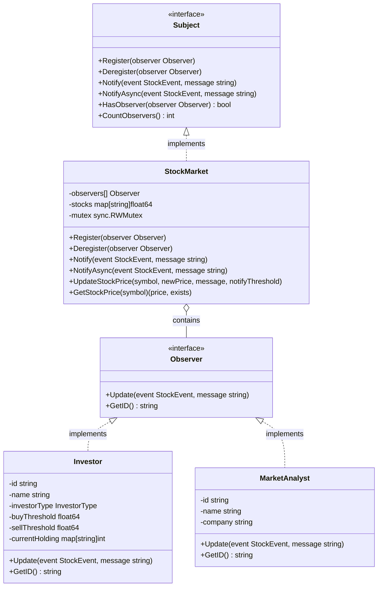

# 观察者模式 (Observer Pattern)

## 概述

观察者模式是一种行为设计模式，它定义了对象之间的一对多依赖关系，使得当一个对象状态发生变化时，所有依赖于它的对象都会得到通知并自动更新。本实现以股票市场为例，展示了观察者模式的核心概念和实际应用。

## 模式结构



## 核心组件

### 主题 (Subject)

- **Subject接口**：定义了主题的核心方法，包括注册、注销和通知观察者。
- **StockMarket**：实现了Subject接口的具体主题，代表一个股票市场。

### 观察者 (Observer)

- **Observer接口**：定义了观察者需要实现的更新方法。
- **Investor**：具体观察者，代表投资者，根据股票价格变动做出投资决策。
- **MarketAnalyst**：具体观察者，代表市场分析师，提供市场分析。

## 实现特点

1. **多种观察者类型**：
   - 根据风险偏好分为保守型、稳健型和激进型投资者
   - 市场分析师根据市场波动提供专业分析

2. **灵活的通知机制**：
   - 支持同步通知和异步通知
   - 支持通知阈值，只有价格变动超过阈值才通知

3. **线程安全**：
   - 使用互斥锁保证在多线程环境下的安全访问

4. **动态订阅/取消**：
   - 观察者可以在运行时注册和注销

## 使用示例

### 创建股票市场和观察者

```go
// 创建一个股票市场
market := NewStockMarket()

// 创建不同类型的观察者
investor1 := NewInvestor("inv1", "保守张", Conservative)
investor2 := NewInvestor("inv2", "稳健王", Moderate)
investor3 := NewInvestor("inv3", "激进李", Aggressive)
analyst := NewMarketAnalyst("anl1", "专家赵", "某证券公司")

// 注册观察者
market.Register(investor1)
market.Register(investor2)
market.Register(investor3)
market.Register(analyst)
```

### 更新股票价格并触发通知

```go
// 更新股票价格，将自动通知观察者
market.UpdateStockPrice("TSLA", 700.0, "特斯拉股票初始价格", 0.1)
market.UpdateStockPrice("TSLA", 770.0, "特斯拉发布新产品", 0.1)

// 使用异步通知
event := StockEvent{
    Symbol:    "AAPL",
    Price:     150.0,
    PrevPrice: 145.0,
    Timestamp: time.Now(),
}
market.NotifyAsync(event, "苹果股价更新")
```

## 投资者行为模式

本实现中的投资者根据不同的风险偏好有不同的行为模式：

| 投资者类型 | 买入阈值 | 卖出阈值 | 买入量基数 | 风险特点 |
|----------|---------|---------|----------|---------|
| 保守型    | +5.0%   | -2.0%   | 100股    | 追求稳定，容忍收益低 |
| 稳健型    | +3.0%   | -5.0%   | 200股    | 平衡风险和收益 |
| 激进型    | +0.5%   | -10.0%  | 500股    | 追求高收益，容忍风险高 |

## 市场分析师行为

分析师根据价格变动百分比提供不同的市场分析：

| 价格变动     | 分析结论                   |
|------------|---------------------------|
| > +5%      | 市场过热，建议获利了结        |
| +2% ~ +5%  | 短期上升趋势，可逢低买入      |
| -2% ~ +2%  | 市场波动不大，维持原有策略     |
| -5% ~ -2%  | 短期下跌趋势，建议观望        |
| < -5%      | 市场恐慌，优质股可以逐步建仓   |

## 优点

1. **松耦合**：主题和观察者之间是松散耦合的，可以独立变化
2. **开闭原则**：可以添加新的观察者而无需修改主题
3. **动态关系**：可以在运行时建立主题和观察者之间的关系
4. **通知顺序**：主题不需要关心观察者处理通知的顺序

## 缺点

1. **意外通知**：观察者无法知道是哪个主题的变化导致的通知
2. **性能问题**：如果观察者太多或处理逻辑复杂，可能导致性能问题
3. **循环依赖**：不小心可能导致循环依赖和递归调用

## 运行测试

项目包含丰富的测试用例，涵盖基本功能、异步通知、不同投资者行为等：

```bash
# 运行所有测试
go test -v

# 运行基准测试
go test -bench=.

# 查看测试覆盖率
go test -cover
```

## 适用场景

1. 当一个对象的状态变化需要通知其他对象时
2. 当对象之间需要松散耦合时
3. 当系统中的对象需要观察另一个对象的状态变化并做出响应时

## 总结

观察者模式是一种强大的设计模式，特别适合实现事件处理系统。本实现通过股票市场的例子，展示了观察者模式如何优雅地处理对象之间的依赖关系和状态变化通知。