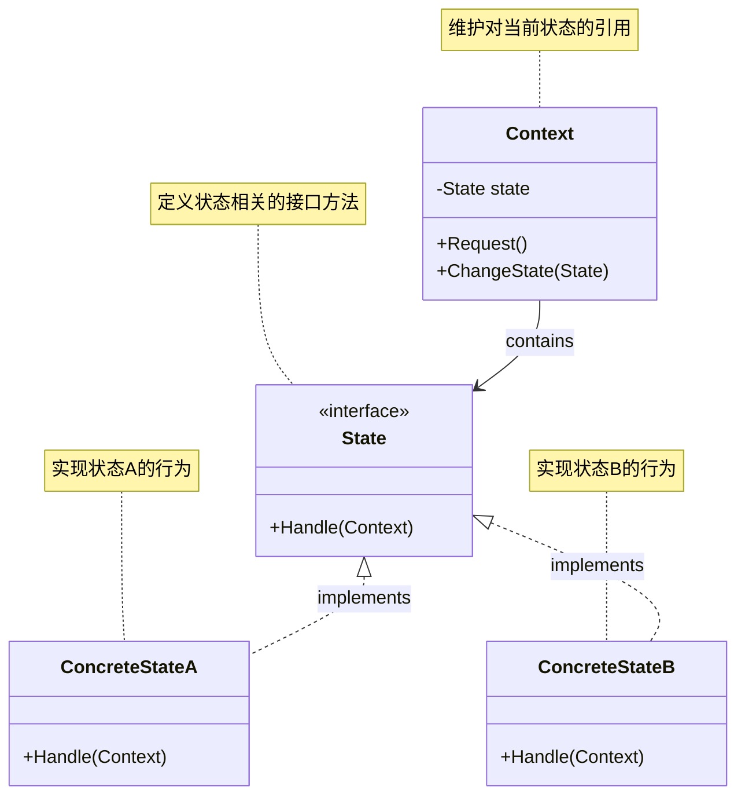
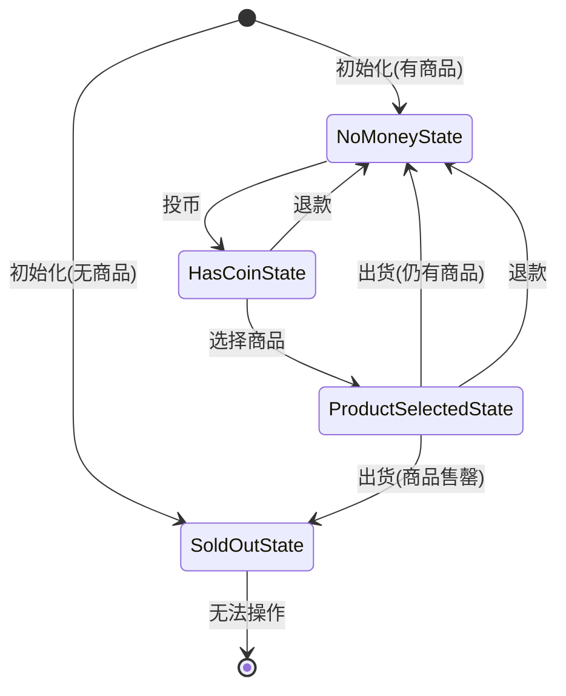

# 状态模式（State Pattern）

## 1. 介绍

状态模式是一种行为型设计模式，它允许对象在内部状态发生改变时改变其行为。这种模式将状态的行为封装在不同的状态类中，并将请求委托给当前状态对象，从而使得对象看起来好像修改了它的类。

## 2. 模式结构



状态模式包含以下主要角色：

1. **上下文(Context)**：维护一个对具体状态对象的引用，并将与状态相关的操作委托给当前状态对象。
2. **状态(State)接口**：定义了一个接口，用于封装与上下文的特定状态相关的行为。
3. **具体状态(ConcreteState)**：每一个具体状态类都实现了状态接口，提供了对应于上下文特定状态的行为实现。

## 3. 何时使用状态模式

- 对象的行为取决于其状态，并且必须在运行时根据状态改变其行为
- 代码中包含大量与对象状态有关的条件语句，导致代码难以维护
- 状态转换规则比较复杂时

## 4. 实现示例：自动售货机

在本例中，我们实现了一个自动售货机系统，它可以根据不同的状态（未投币、已投币、已选择商品、商品售罄）展示不同的行为。

### 4.1 状态接口

```go
type VendingMachineState interface {
    InsertCoin() error          // 投币
    SelectProduct(code string) error  // 选择商品
    Dispense() error            // 出货
    Refund() error              // 退款
    GetStateName() string       // 获取状态名称
}
```

### 4.2 上下文：自动售货机

```go
type VendingMachine struct {
    // 各种状态
    noMoneyState    VendingMachineState
    hasCoinState    VendingMachineState
    productSelectedState VendingMachineState
    soldOutState    VendingMachineState
    
    // 当前状态
    currentState VendingMachineState
    
    // 商品库存
    inventory map[string]int
    // 当前选中的商品
    selectedProduct string
}
```

### 4.3 状态转换逻辑



状态模式的核心在于将不同状态的行为封装到不同的类中，并通过上下文引用当前状态来委派行为。上图展示了自动售货机的状态转换流程：

1. 初始状态为"未投币"（如有商品）或"售罄"（无商品）
2. 投币后进入"已投币"状态
3. 选择商品后进入"已选择商品"状态
4. 出货后根据库存情况回到"未投币"状态或"售罄"状态
5. 在"已投币"或"已选择商品"状态可以进行退款操作，回到"未投币"状态

## 5. 优点

- **简化复杂的状态转换逻辑**：避免了使用大量的if-else语句来切换状态
- **状态封装**：每个状态的行为都封装在对应的状态类中
- **单一责任原则**：每个状态类只负责一个特定状态的行为
- **开闭原则**：可以轻松添加新的状态而不修改已有代码
- **消除庞大的条件分支**：不需要通过条件语句判断当前状态

## 6. 缺点

- **增加类的数量**：每个状态都需要一个单独的类，可能导致类的数量激增
- **状态分散**：状态逻辑分散在多个类中，可能使得系统整体行为变得难以理解
- **可能导致状态爆炸**：如果状态数量过多，管理这些状态类会变得困难

## 7. 与其他模式的关系

- **状态模式** vs **策略模式**：
  - 相似点：两者都基于组合，将不同的行为委托给不同的对象
  - 不同点：状态模式关注对象状态的转换，状态对象知道彼此的存在；策略模式关注算法的互换，策略对象通常不知道其他策略的存在

- **状态模式** vs **有限状态机**：
  - 状态模式是实现有限状态机的一种面向对象方式

## 8. 实际应用场景

- **工作流或业务流程管理**：如订单处理系统（待付款、已付款、已发货、已完成等状态）
- **游戏开发**：控制游戏角色的不同状态（站立、行走、跳跃、攻击等）
- **网络连接管理**：管理连接的不同状态（已连接、断开连接、正在连接等）
- **UI控制**：管理界面元素的不同状态（正常、禁用、焦点等）
- **电子设备控制**：如电梯系统、交通信号灯控制

## 9. 总结

状态模式通过将状态相关的行为封装在独立的类中，并通过对象组合使得状态的切换更加清晰和可维护。它解决了当一个对象需要根据内部状态改变行为，且状态数量较多时的代码组织问题。在自动售货机的例子中，我们看到了如何使用状态模式来组织复杂的状态转换逻辑，从而避免了大量的条件分支语句。

通过状态模式，代码变得更加模块化和可扩展，易于理解和维护。