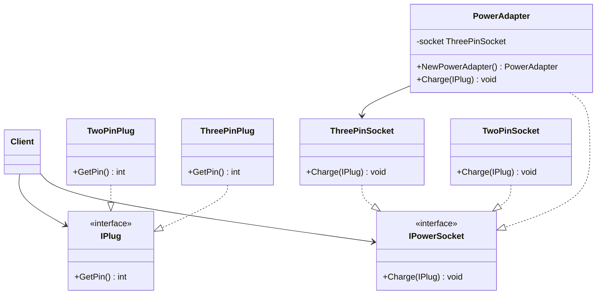

# 适配器模式 (Adapter Pattern)

## 简介

适配器模式是一种结构型设计模式，它允许接口不兼容的对象能够相互合作。适配器模式通过包装一个现有类，提供不同的接口，从而使得原本由于接口不兼容而不能一起工作的类能够协同工作。

就像现实生活中的电源适配器允许我们将不同标准的电器插头插入到不兼容的插座中一样，软件中的适配器也起着类似的作用 - 它们充当两个不兼容接口之间的转换器。

## 问题

想象一个场景：你有一个现有的系统，它使用特定接口。现在你想集成一个新的组件，但这个组件的接口与系统期望的不兼容。你有几个选择：

1. 修改现有系统 - 通常不可行或风险太高
2. 修改新组件 - 如果这是第三方组件，你可能无法修改它
3. 创建一个适配器 - 这是一种优雅的解决方案

## 解决方案

适配器模式通过以下方式解决这个问题：

1. 创建一个实现目标接口的适配器类
2. 适配器持有一个被适配者的引用
3. 目标接口的方法调用被转发到被适配者的相应方法，可能需要进行数据转换

## 结构

适配器模式包括以下关键角色：

- **目标接口 (Target)**: 定义客户端使用的特定领域接口
- **适配器 (Adapter)**: 实现目标接口并包装被适配者对象
- **被适配者 (Adaptee)**: 包含客户端希望使用的功能，但接口不兼容
- **客户端 (Client)**: 通过目标接口与适配器协作

## UML 类图



## 示例：电源适配器

在本实现中，我们用电源插座和插头作为例子：

- 我们有两针和三针两种插头
- 我们有对应的两孔和三孔插座
- 问题：两针插头无法直接使用三孔插座
- 解决方案：创建一个适配器，使两针插头可以使用三孔插座

### 代码结构

1. **插头接口与实现**

```go
// IPlug 定义所有插头的通用接口
type IPlug interface {
    GetPin() int
}

// TwoPinPlug 两针插头的具体实现
type TwoPinPlug struct{}

// GetPin 返回两针插头的针数
func (t *TwoPinPlug) GetPin() int {
    return 2
}

// ThreePinPlug 三针插头的具体实现
type ThreePinPlug struct{}

// GetPin 返回三针插头的针数
func (t *ThreePinPlug) GetPin() int {
    return 3
}
```

2. **插座接口与实现**

```go
// IPowerSocket 定义所有电源插座的通用接口
type IPowerSocket interface {
    Charge(p IPlug) // 统一的充电方法
}

// ThreePinSocket 三孔插座 - 被适配的目标类
type ThreePinSocket struct{}

// Charge 三孔插座只能为三针插头充电
func (s *ThreePinSocket) Charge(p IPlug) {
    if p.GetPin() != 3 {
        fmt.Println("三孔插座无法为非三针插头充电")
        return
    }
    fmt.Println("三孔插座正在为三针插头充电")
}
```

3. **适配器实现**

```go
// PowerAdapter 电源适配器 - 将两针插头适配到三孔插座
type PowerAdapter struct {
    socket *ThreePinSocket // 持有一个三孔插座的引用
}

// NewPowerAdapter 创建一个新的电源适配器
func NewPowerAdapter() *PowerAdapter {
    return &PowerAdapter{
        socket: &ThreePinSocket{},
    }
}

// Charge 适配器的充电方法 - 实现IPowerSocket接口
// 当接收到两针插头时，进行适配转换后使用三孔插座充电
func (a *PowerAdapter) Charge(p IPlug) {
    if p.GetPin() != 2 {
        fmt.Println("适配器只能适配两针插头")
        return
    }

    // 创建一个虚拟的三针插头，这是适配的核心逻辑
    fmt.Println("适配器正在将两针插头转换为三针插头")
    virtualThreePinPlug := &ThreePinPlug{}

    // 使用三孔插座为虚拟的三针插头充电
    a.socket.Charge(virtualThreePinPlug)
    fmt.Println("适配完成，两针插头已成功充电")
}
```

### 使用示例

```go
// 创建组件
twoPin := &TwoPinPlug{}
threePinSocket := &ThreePinSocket{}
adapter := NewPowerAdapter()

// 直接使用三孔插座会失败
threePinSocket.Charge(twoPin) // 输出: 三孔插座无法为非三针插头充电

// 使用适配器成功充电
adapter.Charge(twoPin)
// 输出:
// 适配器正在将两针插头转换为三针插头
// 三孔插座正在为三针插头充电
// 适配完成，两针插头已成功充电
```

## 适配器模式的分类

适配器模式有两种主要形式：

1. **类适配器**：使用继承同时继承目标类和被适配者类（多重继承）
   - Go不支持传统意义上的继承，所以在Go中通常不使用这种形式

2. **对象适配器**：使用组合，将被适配者作为适配器的成员
   - 我们的示例使用的是这种形式，适配器持有一个三孔插座的引用

## 使用场景

适配器模式适用于以下情况：

1. 需要使用现有类，但其接口不符合需求
2. 需要使用一些现有的类，但不能修改其源代码
3. 需要创建可重用的类，该类可以与不相关或不可预见的类协作
4. 需要整合多个不相关接口的功能

## 真实世界的应用例子

1. **数据格式转换器**：如XML到JSON的转换器
2. **数据库驱动适配**：将不同数据库的专有API适配到统一接口
3. **第三方库整合**：适配外部库以符合项目的现有接口
4. **旧系统现代化**：在保留旧系统的同时添加新功能

## 优点

1. **单一职责原则**：将接口转换逻辑从业务逻辑中分离出来
2. **开闭原则**：可以引入新类型的适配器而不破坏现有代码
3. **增加类的透明性**：被适配类的功能对客户端透明
4. **灵活性和复用性**：一个适配器可以适配多个被适配者

## 缺点

1. **增加代码复杂性**：引入新的类，增加了代码的复杂性
2. **可能的性能损失**：额外的一层间接调用可能影响性能
3. **适配器模式是一种"补救"设计**：最好在系统设计初期就考虑接口兼容性

## 与其他模式的关系

- **桥接模式**：适配器改变已有对象的接口，桥接模式将接口与实现分离
- **装饰器模式**：装饰器增强对象功能而不改变其接口，适配器则是改变接口
- **代理模式**：代理模式保持相同的接口，但控制对对象的访问
- **外观模式**：外观为整个子系统定义新接口，适配器使现有接口与另一个接口兼容

## 总结

适配器模式允许我们将不兼容的接口转换为客户端期望的接口，从而使得原本不兼容的类能够协同工作。就像我们的电源适配器例子展示的那样，它允许两针插头可以安全地使用三孔插座充电，通过创建一个符合目标接口但在内部调用被适配对象的适配器来实现这一点。

适配器模式是处理系统集成和组件兼容性问题的强大工具，特别是在无法更改现有代码的情况下。