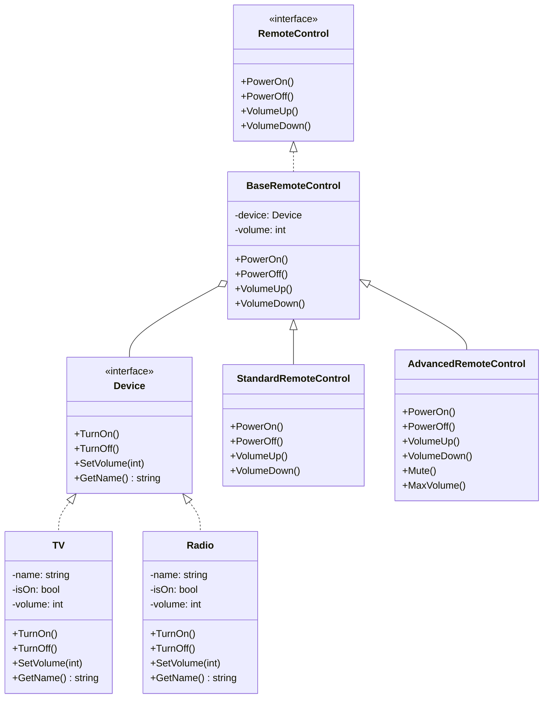

# 桥接模式 (Bridge Pattern)

## 定义与意图

桥接模式是一种结构型设计模式，它将抽象部分与它的实现部分分离，使它们都可以独立地变化。这种模式涉及到一个接口作为桥接，使得实体类的功能独立于接口实现类，这两种类型的类可以结构化地变化而不互相影响。

简单来说，桥接模式通过将继承关系转换为组合关系，实现了抽象和实现的分离，从而提高了系统的可扩展性和灵活性。

## 问题场景

当一个系统需要在多个维度上扩展时，如果使用传统的继承方式，会导致类爆炸问题。

例如，如果我们有不同类型的遥控器（标准遥控器、高级遥控器）和不同类型的设备（电视、收音机），使用继承方式设计可能会产生如下类层次结构：
- StandardTVRemote
- StandardRadioRemote
- AdvancedTVRemote
- AdvancedRadioRemote

如果再增加一种设备或遥控器类型，继承结构会急剧扩张，难以维护。

## 解决方案

桥接模式提供了一种更好的解决方案：将遥控器（抽象）和设备（实现）分离成两个独立的层次结构，通过组合（而不是继承）将它们关联起来。

遥控器层次结构：
- RemoteControl（接口）
  - BaseRemoteControl
    - StandardRemoteControl
    - AdvancedRemoteControl

设备层次结构：
- Device（接口）
  - TV
  - Radio

这样，当需要增加新的设备或遥控器时，只需要在相应的层次结构中添加新类，而不会影响到另一个维度。

## UML类图



## 代码实现分析

### 实现部分（设备）

```go
// Device 表示设备的接口，这是"实现部分"的接口
type Device interface {
    TurnOn()         // 开启设备
    TurnOff()        // 关闭设备
    SetVolume(int)   // 设置音量
    GetName() string // 获取设备名称
}
```

`TV` 和 `Radio` 是 `Device` 接口的具体实现：

```go
// TV 电视机实现了Device接口
type TV struct {
    name   string
    isOn   bool
    volume int
}

// Radio 收音机实现了Device接口
type Radio struct {
    name   string
    isOn   bool
    volume int
}
```

### 抽象部分（遥控器）

```go
// RemoteControl 表示遥控器的抽象，这是"抽象部分"的基础
type RemoteControl interface {
    PowerOn()    // 开启电源
    PowerOff()   // 关闭电源
    VolumeUp()   // 提高音量
    VolumeDown() // 降低音量
}
```

`BaseRemoteControl` 提供了一个基础实现，它持有一个 `Device` 接口的引用：

```go
// BaseRemoteControl 是所有遥控器的基础实现
type BaseRemoteControl struct {
    device Device // 持有对Device的引用——这是桥接模式的核心
    volume int    // 当前音量
}
```

`StandardRemoteControl` 和 `AdvancedRemoteControl` 在基础遥控器的基础上进行扩展：

```go
// StandardRemoteControl 标准遥控器扩展了基础遥控器
type StandardRemoteControl struct {
    *BaseRemoteControl
}

// AdvancedRemoteControl 高级遥控器扩展了基础遥控器，添加了额外功能
type AdvancedRemoteControl struct {
    *BaseRemoteControl
}

// Mute 静音功能（高级遥控器特有）
func (a *AdvancedRemoteControl) Mute() {
    // ...
}

// MaxVolume 最大音量功能（高级遥控器特有）
func (a *AdvancedRemoteControl) MaxVolume() {
    // ...
}
```

### 桥接模式的关键点

这个实现中的桥接模式关键是 `BaseRemoteControl` 持有 `Device` 接口的引用：

```go
type BaseRemoteControl struct {
    device Device // 这是桥接模式的桥梁
    volume int
}
```

通过这种方式，遥控器的行为被委托给具体的设备实现，从而实现抽象与实现的分离。

## 使用示例

```go
// 创建具体设备
tv := NewTV("Samsung")
radio := NewRadio("Sony")

// 创建标准遥控器，控制电视
standardRemote := NewStandardRemoteControl(tv)
standardRemote.PowerOn()      // 开启电视
standardRemote.VolumeUp()     // 调高音量
standardRemote.PowerOff()     // 关闭电视

// 创建高级遥控器，控制收音机
advancedRemote := NewAdvancedRemoteControl(radio)
advancedRemote.PowerOn()      // 开启收音机
advancedRemote.Mute()         // 静音（高级功能）
advancedRemote.MaxVolume()    // 最大音量（高级功能）
advancedRemote.PowerOff()     // 关闭收音机
```

## 桥接模式的优势

1. **分离抽象接口及其实现部分**：抽象和实现可以独立地变化而不互相影响。

2. **提高可扩展性**：可以独立地添加新的抽象（遥控器）或实现（设备）而不互相影响。

3. **隐藏实现细节**：客户端代码只需要处理抽象接口，不需要了解具体实现。

4. **避免类爆炸**：通过组合代替多层次继承，避免类的数量呈指数增长。

5. **运行时切换实现**：可以在运行时动态切换不同的实现。

## 桥接模式的劣势

1. **增加复杂度**：对于简单系统，引入桥接模式可能增加不必要的复杂度。

2. **需要正确识别抽象和实现**：设计初期需要正确识别系统中的抽象和实现维度，否则后期重构成本较高。

3. **接口稳定性要求高**：一旦确定桥接接口，修改成本较高，需要在设计阶段充分考虑。

## 适用场景

1. **需要在多个维度上扩展**：当系统需要沿着多个维度变化，且这些维度相对独立时。

2. **需要运行时切换实现**：当需要在运行时动态切换实现而不修改抽象代码时。

3. **需要对客户端隐藏实现细节**：当希望实现细节对客户端透明时。

4. **避免永久绑定**：希望抽象和实现不要永久绑定在一起。

5. **类层次结构爆炸**：当使用继承会导致类的数量呈爆炸性增长时。

## 与其他模式的关系

1. **桥接模式与适配器模式**：适配器模式用于使不兼容的接口协同工作，而桥接模式则是在设计之初就考虑让抽象和实现分离。

2. **桥接模式与策略模式**：策略模式通常只关注算法的封装和切换，而桥接模式则处理更复杂的抽象-实现分离问题。

3. **桥接模式与抽象工厂模式**：抽象工厂可以与桥接模式配合使用，创建适合特定抽象的实现对象。

4. **桥接模式与组合模式**：桥接通常在设计之初就确定，而组合则是动态组合对象树。

## 实际应用示例

1. **GUI框架**：抽象窗口工具包（如按钮、窗口）与不同平台实现的分离。

2. **数据库驱动**：JDBC等数据库接口与具体数据库驱动实现的分离。

3. **设备驱动程序**：操作系统设备接口与具体硬件驱动的分离。

4. **图形渲染系统**：抽象图形API与不同图形库实现的分离。

5. **跨平台应用程序**：应用程序逻辑与特定平台实现的分离。

## 总结

桥接模式是一种强大的结构型设计模式，它通过将抽象部分与实现部分分离，使两者可以独立变化。在我们的示例中，遥控器（抽象部分）和设备（实现部分）可以独立扩展，不会相互影响。

这种模式在需要处理多维度变化的系统中特别有用，可以避免类层次结构的爆炸性增长，同时提高代码的可维护性和扩展性。然而，它也增加了一定的复杂性，因此在应用时需要谨慎权衡。

桥接模式的核心是"使用组合代替继承"，这也是面向对象设计中的一个重要原则：组合优于继承。通过合理使用桥接模式，我们可以设计出更加灵活、可扩展的系统架构。