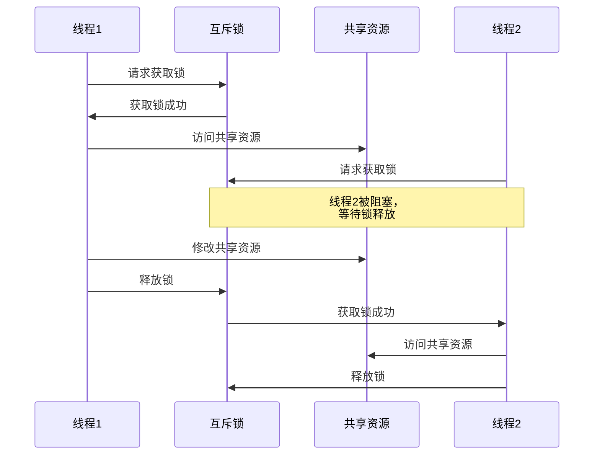
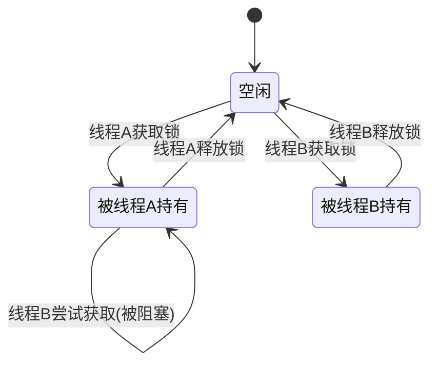
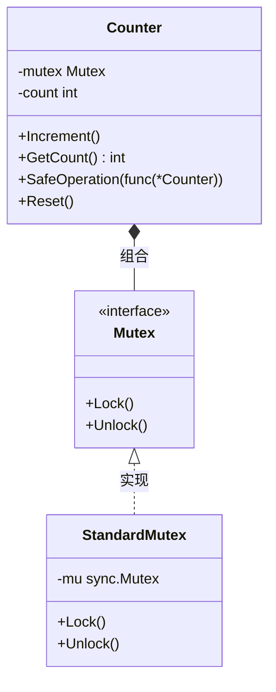
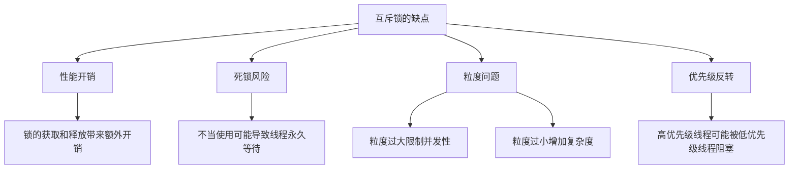
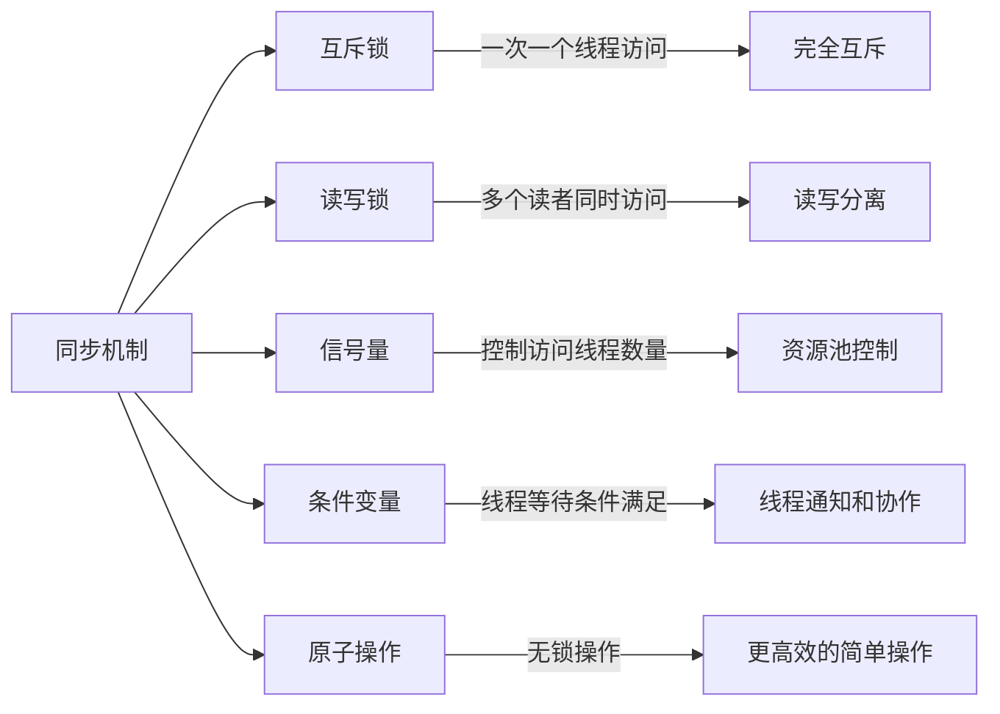

# 互斥锁模式 (Mutex Pattern)

## 介绍

互斥锁模式是一种同步设计模式，用于控制对共享资源的并发访问，确保在同一时刻只有一个线程可以访问该资源。它是解决并发问题最基本也是最常用的同步机制之一。



## 为什么需要互斥锁

在多线程/并发环境下，多个线程可能同时访问和修改共享资源，如果不进行同步控制，会导致以下问题：

1. **竞态条件 (Race Condition)**: 当多个线程同时访问和修改同一数据时，最终结果依赖于线程执行的精确时序，导致不确定的结果
2. **数据不一致**: 由于操作被意外中断或交错执行，数据可能处于无效或不一致的状态
3. **内存可见性问题**: 一个线程对共享数据的修改可能对其他线程不可见

互斥锁通过在访问共享资源时提供互斥(mutual exclusion)机制解决这些问题。

## 互斥锁模式的基本原理

互斥锁模式的核心思想是：

1. 在访问共享资源前，线程必须先获取锁
2. 一次只有一个线程可以获得锁
3. 当线程持有锁时，其他尝试获取该锁的线程会被阻塞，直到锁被释放
4. 线程使用完共享资源后必须释放锁，允许其他线程获取锁并访问资源



## 代码实现

我们的实现通过以下几个部分构成：

### 1. 互斥锁接口

```go
// Mutex 定义互斥锁接口
type Mutex interface {
    Lock()   // 获取锁
    Unlock() // 释放锁
}
```

### 2. 标准互斥锁实现

```go
// StandardMutex 标准互斥锁实现，封装Go的sync.Mutex
type StandardMutex struct {
    mu sync.Mutex
}

// Lock 获取互斥锁
func (m *StandardMutex) Lock() {
    m.mu.Lock()
}

// Unlock 释放互斥锁
func (m *StandardMutex) Unlock() {
    m.mu.Unlock()
}
```

### 3. 受保护的计数器

```go
// Counter 计数器结构体，使用互斥锁保护共享数据
type Counter struct {
    mutex Mutex // 使用接口而非具体类型
    count int
}

// Increment 增加计数器的方法，受互斥锁保护
func (c *Counter) Increment() {
    c.mutex.Lock()
    defer c.mutex.Unlock()

    c.count++
    fmt.Println("增加后的计数:", c.count)
}

// GetCount 获取当前计数值，同样受到互斥锁保护
func (c *Counter) GetCount() int {
    c.mutex.Lock()
    defer c.mutex.Unlock()

    return c.count
}
```

### 4. 安全操作模式

```go
// SafeOperation 在锁的保护下执行操作
func (c *Counter) SafeOperation(operation func(*Counter)) {
    c.mutex.Lock()
    defer c.mutex.Unlock()

    operation(c)
}
```

## 设计要点



1. **接口抽象**：我们定义了`Mutex`接口，而不是直接使用具体的锁实现，这使得代码更加灵活
2. **依赖注入**：通过`NewCounterWithMutex`函数允许注入不同的锁实现，便于测试和扩展
3. **延迟解锁**：使用`defer`语句确保锁始终被释放，即使函数异常退出
4. **安全操作模式**：`SafeOperation`方法提供了一种模式，确保操作总是在锁的保护下执行

## 使用示例

### 基本使用

```go
// 创建计数器
counter := NewCounter()

// 增加计数
counter.Increment()

// 获取当前值
count := counter.GetCount()
fmt.Printf("当前计数: %d\n", count)

// 重置计数器
counter.Reset()
```

### 安全操作模式

```go
counter := NewCounter()

// 在锁的保护下执行复杂操作
counter.SafeOperation(func(c *Counter) {
    // 可以安全地直接访问受保护的字段
    c.count += 10
    fmt.Printf("计数已增加到: %d\n", c.count)
    
    // 执行其他操作...
    c.count *= 2
})
```

### 并发场景

```go
counter := NewCounter()
var wg sync.WaitGroup

// 启动多个goroutine同时增加计数器
for i := 0; i < 100; i++ {
    wg.Add(1)
    go func() {
        defer wg.Done()
        counter.Increment()
    }()
}

wg.Wait()
fmt.Printf("最终计数: %d\n", counter.GetCount()) // 将输出: 最终计数: 100
```

## 互斥锁模式的优点

1. **确保数据一致性**：防止多个线程同时修改共享资源
2. **简单易用**：锁是最简单直接的同步机制
3. **解决可见性问题**：确保一个线程对共享数据的修改对其他线程可见
4. **防止竞态条件**：排除多线程交错执行导致的不确定结果

## 互斥锁模式的缺点



1. **性能开销**：锁的获取和释放有开销，可能影响程序性能
2. **死锁风险**：不当使用可能导致死锁
3. **粒度问题**：锁粒度过大会限制并发性，过小会增加复杂度和开销
4. **优先级反转**：高优先级线程可能被低优先级线程阻塞

## 互斥锁适用场景

互斥锁模式特别适用于以下场景：

1. **共享资源访问控制**：多个线程需要访问和修改相同的数据
2. **确保操作原子性**：需要将一组操作作为原子单元执行
3. **状态保护**：保护对象的内部状态不受并发访问的影响
4. **限制并发访问**：需要控制同时访问某资源的线程数量

## 最佳实践

1. **最小化锁的作用域**：尽可能减小锁保护的代码段，避免不必要的阻塞
2. **避免在持有锁时执行耗时操作**：特别是I/O操作
3. **使用延迟解锁**：用`defer`确保锁总是被释放，避免死锁
4. **保持锁获取顺序一致**：如需获取多个锁，总是以相同顺序获取，避免死锁
5. **考虑替代方案**：对于某些场景，无锁数据结构、原子操作或更细粒度的锁可能更合适

## 与其他同步模式的对比



- **读写锁**：允许多读单写，比互斥锁更灵活
- **信号量**：可以控制同时访问资源的线程数量
- **条件变量**：线程间协作的同步机制
- **原子操作**：对于简单的计数器等，原子操作可能比锁更高效

## 总结

互斥锁模式是并发编程中最基础也是最重要的同步模式之一。通过确保在任何时刻只有一个线程可以访问共享资源，互斥锁有效地解决了并发访问的安全问题。在使用互斥锁时，需要平衡安全性、性能和设计复杂度，合理选择锁的粒度和作用范围。

我们的实现通过接口抽象和依赖注入提供了灵活性，同时通过安全操作模式和延迟解锁确保了正确使用锁的最佳实践。